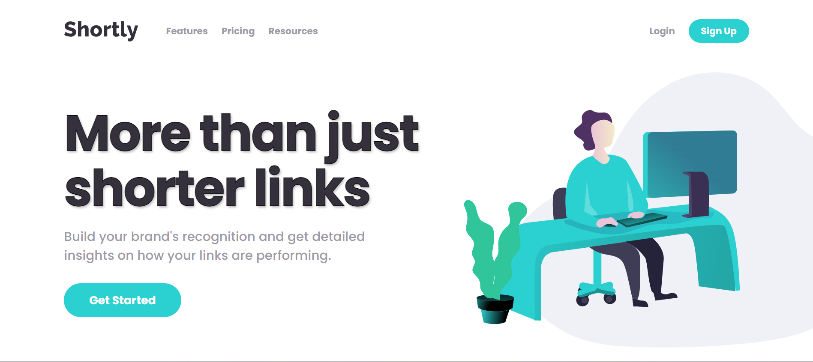

# Frontend Mentor - Shortly URL shortening API Challenge solution

This is a solution to the [Shortly URL shortening API Challenge challenge on Frontend Mentor](https://www.frontendmentor.io/challenges/url-shortening-api-landing-page-2ce3ob-G). Frontend Mentor challenges help you improve your coding skills by building realistic projects.

## Table of contents

- [The challenge](#the-challenge)
- [Screenshot](#screenshot)
- [Links](#links)
- [Built with](#built-with)
- [Author](#author)

### The challenge

Users should be able to:

- View the optimal layout for the site depending on their device's screen size
- Shorten any valid URL
- See a list of their shortened links, even after refreshing the browser
- Copy the shortened link to their clipboard in a single click
- Receive an error message when the `form` is submitted if:
  - The `input` field is empty

### Screenshot

### Links

- Solution URL: [Add solution URL here](https://your-solution-url.com)
- Live Site URL: [Add live site URL here](https://url-shortening-api-iykekelvins.vercel.app/)

### Built with

- Semantic HTML5 markup
- SASS
- Flexbox
- Vanilla Javascript

## Author

- Website - [Kelvin Ochubili](https://kelvin-folio-v1.vercel.app)
- Frontend Mentor - [@iykekelvins](https://www.frontendmentor.io/profile/iykekelvins)
- Twitter - [@iykekelvins](https://www.twitter.com/iykekelvins)
